# BioAgentic: Biotech Research Agent System

A simplified agentic system for searching clinical trial data and academic literature, generating hypotheses about drug targets, and debating their merits — inspired by Denario's LangGraph modularity and ASCollab's peer-review dynamics. Designed as a lean side-project (~400-500 LOC total) using Grok API.

## User Review Required

> [!IMPORTANT]
> **Grok API key required.** You'll need an `XAI_API_KEY` from [x.ai](https://x.ai). The system uses `grok-4-mini` (cheapest option). Can easily swap to OpenAI/Anthropic via LangChain.

> [!IMPORTANT]
> **No jury/voting system.** Per your request, the pipeline uses a debate-only workflow (advocate → skeptic → mediator → synthesizer) with no scoring or majority vote.

> [!WARNING]
> **PubMed E-utilities has a rate limit** of 3 requests/second without an API key, 10/sec with one. We'll add a free NCBI API key option in `.env` for higher throughput, but it's optional.

## Architecture Overview

```mermaid
graph TD
    A["🔍 User Input<br/>(e.g. KRAS G12C)"] --> B["Target Analyzer"]
    B --> C["Trials Scout"]
    B --> D["Literature Miner"]
    C --> E["Hypothesis Generator"]
    D --> E
    E --> F["Debate Loop N rounds"]
    F --> G["Advocate"]
    G --> H["Skeptic"]
    H --> I["Mediator"]
    I -->|"more rounds"| G
    I -->|"done"| J["Synthesizer"]
    J --> K["Markdown Brief"]
```



**Key design decisions:**
- **Inspired by Denario:** TypedDict-based state, LangGraph StateGraph, conditional routing, iterative loops
- **Inspired by ASCollab:** Debate with heterogeneous agent personalities (advocate/skeptic roles), peer review via mediator, iterative refinement
- **Simplified from both:** No paper writing, no code execution, no cosmology modules, no jury voting — just search → hypothesize → debate → synthesize

## Proposed Changes

### Project Structure

```
/Users/felix/BioAgentic/
├── .env                    # API keys
├── pyproject.toml          # Dependencies
├── README.md               # Project overview
└── bioagentic/
    ├── __init__.py
    ├── config.py            # Model config, env loading
    ├── state.py             # TypedDict state classes
    ├── prompts.py           # All agent system prompts
    ├── tools/
    │   ├── __init__.py
    │   ├── clinical_trials.py   # ClinicalTrials.gov API v2
    │   ├── pubmed.py            # PubMed E-utilities
    │   └── semantic_scholar.py  # Semantic Scholar API
    ├── agents/
    │   ├── __init__.py
    │   ├── analyzer.py      # Target analyzer node
    │   ├── scouts.py        # Trials scout + Literature miner
    │   ├── hypothesis.py    # Hypothesis generator
    │   └── debate.py        # Advocate, Skeptic, Mediator, Synthesizer
    ├── graph.py             # LangGraph StateGraph builder
    └── server.py            # FastAPI + SSE streaming
```

---

### Config & State

#### [NEW] `.env`
Environment variables: `XAI_API_KEY` (required), `NCBI_API_KEY` and `SEMANTIC_SCHOLAR_KEY` (optional).

#### [NEW] `pyproject.toml`
Minimal deps: `langgraph`, `langchain-xai`, `langchain-core`, `fastapi`, `uvicorn`, `requests`, `python-dotenv`, `pydantic`.

#### [NEW] `config.py`
Load `.env`, expose keys, default model `grok-4-mini`, create `ChatXAI` LLM instance.

#### [NEW] `state.py`
Denario-inspired TypedDicts:
- `APIData` — trials + papers results
- `DebateState` — history, round counter
- `BiotechState` — main GraphState: `messages`, `target`, `api_data`, `hypotheses`, `debate`, `brief`

---

### API Tools

#### [NEW] `clinical_trials.py`
`fetch_trials(target)` — ClinicalTrials.gov REST API v2 `/studies` endpoint. Returns trial count, titles, phases, statuses.

#### [NEW] `pubmed.py`
`fetch_papers(target)` — PubMed E-utilities `esearch` + `efetch`. Returns top abstracts with titles, authors, year.

#### [NEW] `semantic_scholar.py`
`search_papers(query)` — Semantic Scholar API. Pattern borrowed from Denario's `SSAPI()`.

---

### Agent Prompts & Nodes

#### [NEW] `prompts.py`
Eight prompts following Denario's `HumanMessage` style: Target Analyzer, Trials Scout, Literature Miner, Hypothesis Generator, Advocate, Skeptic, Mediator, Synthesizer.

#### [NEW] `agents/`
- `analyzer.py` — parse target input
- `scouts.py` — call API tools then LLM to analyze
- `hypothesis.py` — generate 3 hypotheses from combined data
- `debate.py` — N rounds of advocate→skeptic→mediator, then synthesis

---

### Graph & Server

#### [NEW] `graph.py`
LangGraph `StateGraph`: `Entry → analyzer → [trials, literature] → hypothesis → debate_loop → synthesizer → END`. Conditional routing for debate rounds (Denario's `router()` pattern).

#### [NEW] `server.py`
FastAPI with `POST /research` (JSON response) and `POST /research/stream` (SSE). Pydantic models for request/response. CORS middleware.

---

### Documentation

#### [MODIFY] `README.md`
Replace placeholder with project description, setup, usage, architecture diagram.

## Verification Plan

### API Integration Tests (no LLM key needed)

Test each tool module returns real data:

```bash
cd /Users/felix/BioAgentic && pip install -e .
python -c "
from bioagentic.tools.clinical_trials import fetch_trials
from bioagentic.tools.pubmed import fetch_papers
from bioagentic.tools.semantic_scholar import search_papers
print('--- Trials ---')
print(fetch_trials('KRAS G12C')[:500])
print('--- PubMed ---')
print(fetch_papers('KRAS G12C inhibitor')[:500])
print('--- Semantic Scholar ---')
print(search_papers('KRAS G12C drug resistance')[:500])
"
```

### End-to-End Test (requires `XAI_API_KEY`)

```bash
# Start server
uvicorn bioagentic.server:app --host 0.0.0.0 --port 8000 &

# Test endpoint
curl -X POST http://localhost:8000/research \
  -H "Content-Type: application/json" \
  -d '{"target": "KRAS G12C", "rounds": 2}'
```

### Manual Verification
1. Start server with `uvicorn bioagentic.server:app --reload`
2. POST `{"target": "KRAS G12C", "rounds": 2}` to `/research`
3. Verify response has: `hypotheses` (3 items), `debate_history`, structured `brief`, `agents_log`
4. Test SSE at `/research/stream` for real-time agent messages
