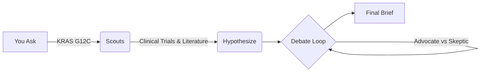
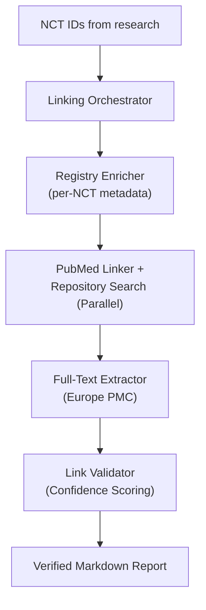

<div align="center">
  
  <h1>ClinicalAgents </h1>
  <p><strong>Agentic research for clinical trail data.</strong></p>
  
  <p>Designed by Felix & Fred to help research at Cambridge.</p>

  <a href="#quick-start">Quick Start</a> •
  <a href="#how-it-works">How it Works</a> •
  <a href="#deployment">Deployment</a>
</div>

<br/>

ClinicalAgents is an open-source tool that acts as a research partner. It searches both **ClinicalTrials.gov** and **academic literature** (PubMed, Semantic Scholar), analyzes the data, and rigorously debates hypotheses to keep outputs accurate and honest.

We built this because "black box" AI tools often give answers without showing their work. BioAgentic is open, transparent, and designed to help you think faster, not just retrieve links. It can run locally, respects privacy, and meticulously cites its sources.

## Quick Start
Get up and running in seconds. You'll need Python 3.11+, Node 18+, and a Grok API key.

```bash
# 1. Get the code
git clone https://github.com/Felixburton7/BioAgentic.git
cd BioAgentic

# 2. Configure (just adds your key)
cp .env.example .env

# 3. Launch
./start.sh
```

The backend will start on port `8000` and the frontend on `3000`.

## How it Works: The Research Pipeline

BioAgentic doesn't just search; it thinks. When you give it a target (like "KRAS G12C"), it spins up a team of specialized agents:



1.  **Scout**: Agents mine real-time data from the **ClinicalTrials.gov API v2** for trial status, enrollment, and sponsors. Crucially, they also cross-reference this by searching **PubMed** and **Semantic Scholar** for primary academic literature.
2.  **Hypothesize**: It generates novel hypotheses based on the synthesis of raw trial data and academic papers.
3.  **Debate**: An "Advocate" and a "Skeptic" agent vigorously debate these hypotheses in rounds, with a Mediator keeping them on track. This adversarial agentic process kills hallucinations, sharpens arguments, and ensures only strong, evidence-backed claims surface.
4.  **Synthesize**: You get a clean, deeply-cited research brief.

## Deep Dive: Clinical Trial → Publication Linking

Once initial research is complete, you can trigger a specialized multi-agent pipeline to find **hidden links** between clinical trials and published papers/datasets (the "Find related clinical trial papers" feature).



This dedicated pipeline:
1. **Enriches** trial metadata directly from the ClinicalTrials.gov registry.
2. **Searches** PubMed creatively (by NCT ID and heuristic titles) and queries data repositories (Zenodo, Vivli).
3. **Extracts** full text via Europe PMC to look for embedded Data Availability Statements.
4. **Validates** all findings with a reasoning agent that deduplicates results and assigns High/Medium/Low confidence tiers to the trial-publication pairing.
5. Streams the entire thought process and results directly to the UI in real-time.

## Deployment

### Railway (Backend)
The repo works out of the box with Railway. Just connect your GitHub and it will pick up the `railway.json` and `Dockerfile`.

### Vercel (Frontend)
Point Vercel to the `frontend/` directory.

## Project Structure
*   `backend/`: FastAPI, LangGraph agents, and tools.
*   `frontend/`: Next.js 16 app for the interface.

## License
MIT. Go wild.

