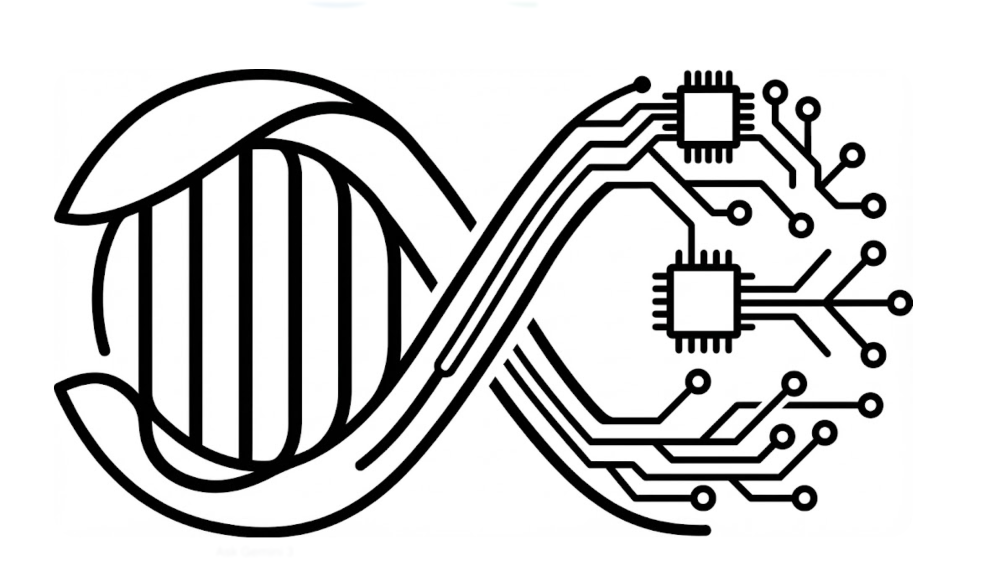
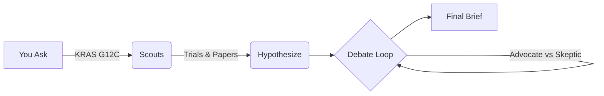

<div align="center">
  
  <h1>TrialAgent </h1>
  <p><strong>Agentic research for clinical trail data.</strong></p>
  
  <p>Designed by Felix & Fred to help research at Cambridge.</p>

  <a href="#quick-start">Quick Start</a> •
  <a href="#how-it-works">How it Works</a> •
  <a href="#deployment">Deployment</a>
</div>

<br/>

BioAgentic is an open-source tool that acts as a research partner. It reads the papers checks the trials data, and debates hypotheses to keep it accurate & honest.

We built this because as "black box" AI tools that give answers without showing the work. BioAgentic is open, transparent, and designed to help you think faster, not just retrieve links. It can run locally, respects privacy, and cites its sources.

## Quick Start
Get up and running in seconds. You'll need Python 3.11+, Node 18+, and a Grok API key.

```bash
# 1. Get the code
git clone https://github.com/Felixburton7/BioAgentic.git
cd BioAgentic

# 2. Configure (just adds your key)
cp .env.example .env

# 3. Launch
./start.sh
```

The backend will start on port `8000` and the frontend on `3000`.

## How it Works

BioAgentic doesn't just search; it thinks. When you give it a target (like "KRAS G12C"), it spins up a team of specialized agents:



1.  **Scout**: Agents mine real-time data from the **ClinicalTrials.gov API v2**, extracting key details like recruitment status, enrollment numbers, sponsors, and conditions. They also cross-reference this with academic literature (PubMed, Semantic Scholar).
2.  **Hypothesize**: It generates novel hypotheses based on the raw data.
3.  **Debate**: An "Advocate" and a "Skeptic" agent debate these hypotheses in rounds, with a Mediator keeping them on track. This adversarial process kills hallucinations and sharpens arguments.
4.  **Synthesize**: You get a clean, cited research brief.

## Deployment

### Railway (Backend)
The repo works out of the box with Railway. Just connect your GitHub and it will pick up the `railway.json` and `Dockerfile`.

### Vercel (Frontend)
Point Vercel to the `frontend/` directory.

## Project Structure
*   `backend/`: FastAPI, LangGraph agents, and tools.
*   `frontend/`: Next.js 16 app for the interface.

## License
MIT. Go wild.

